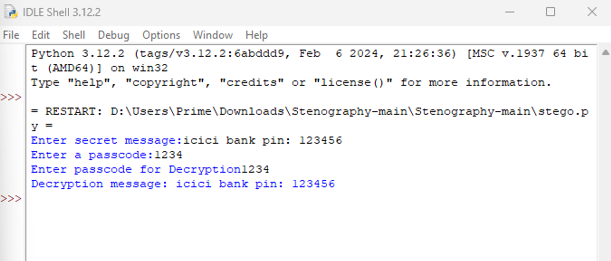

# 🔒 LSB-Based Steganography

a python project to hide and extract secret messages from images using **least significant bit (lsb)** steganography.

## Getting started 
- install Python IDLE
- download opencv from terminal: pip install opencv-python

## 🚀 features
- 🔐 hide and extract secret messages  
- 🖼️ supports png, jpg formats  
- ⚡ simple command-line usage  

## output

